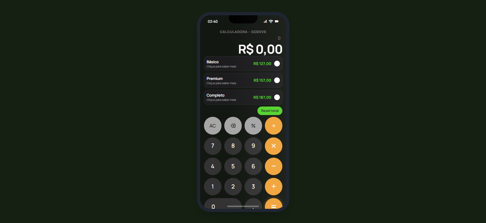

# 🧮 Calculadora de Orçamento em Tempo Real

<div align="center">


</div>

## 📋 Sobre o Projeto

Este projeto foi desenvolvido como parte de um **desafio proposto na plataforma dos alunos do [Luan Oliveira (In100tiva)](https://github.com/in100tiva)**, professor do **GoDevs**. A iniciativa visa colocar em prática os conhecimentos adquiridos durante o curso, incentivando os alunos a construírem projetos reais e funcionais.

## 🖼️ Preview

<div align="center">



</div>

A calculadora possui um design inspirado no iPhone com:
- Barra de status realista
- Notch característico
- Teclado numérico estilizado
- Cards de seleção de planos interativos
- Cores vibrantes com destaque em verde (#53d22d)

## ✨ Benefícios para o Usuário

| Benefício | Descrição |
|-----------|-----------|
| 🎯 **Cálculos Precisos** | Realize operações matemáticas com precisão utilizando a biblioteca Decimal.js |
| 📱 **Design Responsivo** | Interface moderna com visual inspirado no iPhone, adaptável a qualquer dispositivo |
| 💰 **Seleção de Planos** | Compare e selecione entre planos Básico (R$ 127), Premium (R$ 157) e Completo (R$ 187) |
| ⚡ **Tempo Real** | Visualize o valor total do orçamento atualizado instantaneamente |
| 🌙 **Tema Escuro** | Interface elegante com tema dark que reduz a fadiga visual |
| 🔢 **Calculadora Completa** | Todas as operações básicas: soma, subtração, multiplicação, divisão e porcentagem |
| 🔄 **Reset Rápido** | Limpe os cálculos e recomece facilmente com um clique |
| 🎨 **UX Intuitiva** | Experiência de usuário fluida e fácil de usar |

## 🚀 Tecnologias Utilizadas

- **HTML5** - Estrutura semântica
- **CSS3** - Estilização customizada
- **JavaScript** - Lógica e interatividade
- **Tailwind CSS** - Framework de estilos utilitários
- **Decimal.js** - Precisão em cálculos decimais
- **Google Fonts (Manrope)** - Tipografia moderna
- **Material Symbols** - Ícones elegantes

## 📦 Como Usar

1. Clone o repositório:
```bash
git clone https://github.com/Guielihan/calculadora-de-orcamento-tempo-real.git
```

2. Abra o arquivo `index.html` no seu navegador

3. Pronto! Comece a calcular seus orçamentos 🎉

## 👨‍💻 Desenvolvedor

<div align="center">

### Guilherme Queiroz

[](https://github.com/Guielihan)
[](https://discord.com/users/guielihan)
[](mailto:devguielihan@gmail.com)
[](mailto:guielihan@outlook.com)

</div>

## 🎓 Agradecimentos

- **[Luan Oliveira (In100tiva)](https://github.com/in100tiva)** - Professor do GoDevs pelo desafio e ensinamentos
- **[GoDevs](https://godevs.in100tiva.com/)** - Plataforma de ensino de programação

---

<div align="center">

Feito com 💚 por **Guilherme Queiroz** | GoDevs 2026

</div>